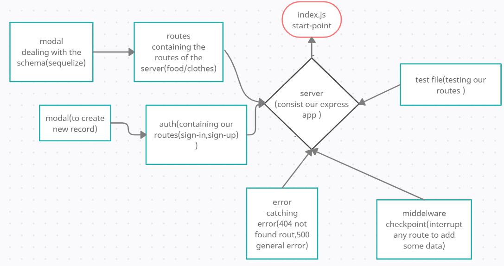

# auth-api
## heroku:https://marwan-auth-api.herokuapp.com/
## pull-req:https://github.com/marwanrawshedh/auth-api/pull/1
on lab 401-08 i take the starter code as that written in the lab guideline ,
I installed all the dependencies(dotenv ,express,jest,supertest,sqlite3,sequelize,pg)
after that I orgnized this starter code to git one server and one index file as a start point.
then i created v2 as it is required that contain
- app.get
- app.post
- app.put 
- app.patch 
- app.delete

after that I built the test , as it is required, Assert the following

AUTH Routes
- POST /signup 
- POST /signin with basic authentication 

V1 (Unauthenticated API) routes
- POST /api/v1/:model
- GET /api/v1/:model 
- GET /api/v1/:model/ID 
- PUT /api/v1/:model/ID 
- DELETE /api/v1/:model/ID  

V2 (Authenticated API Routes)
- POST /api/v2/:model 
- GET /api/v2/:model 
- PUT /api/v2/:model
- DELETE /api/v2/:model

before the deployment I tested my code and everything went fine.
finally I did ACP and merged dev branch with main branch.
and regarding heroku deployment i did as it is required i added the config var.

